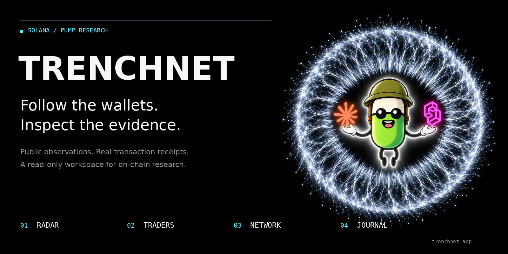
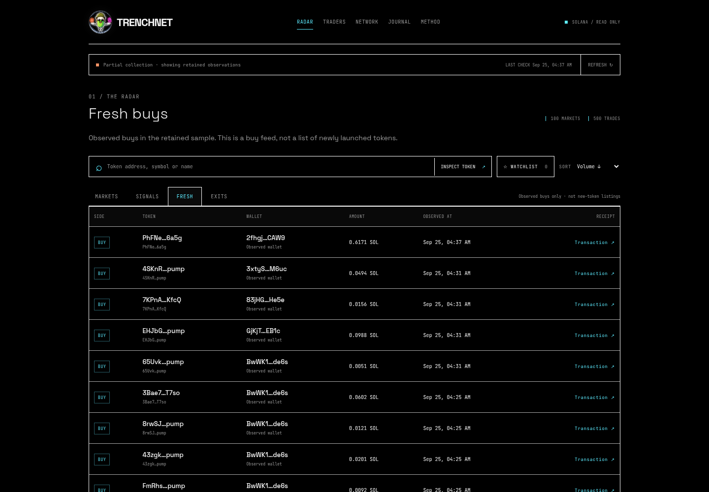
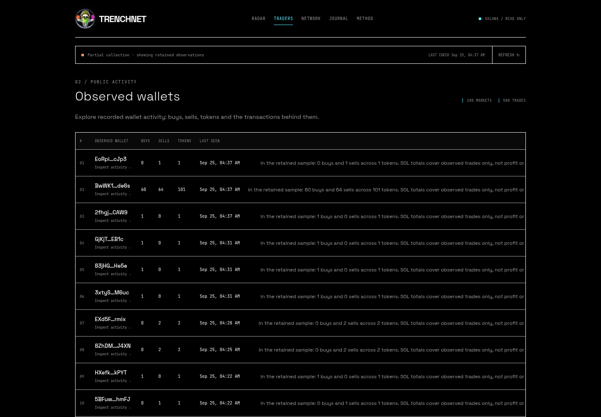
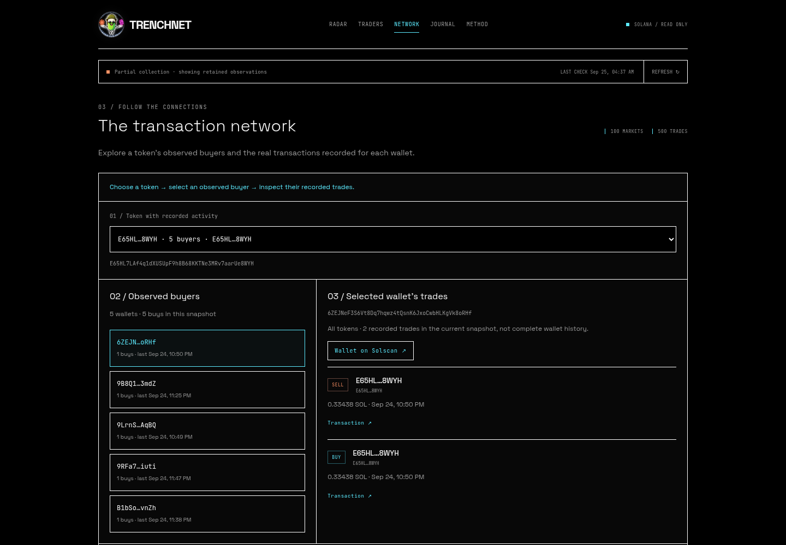
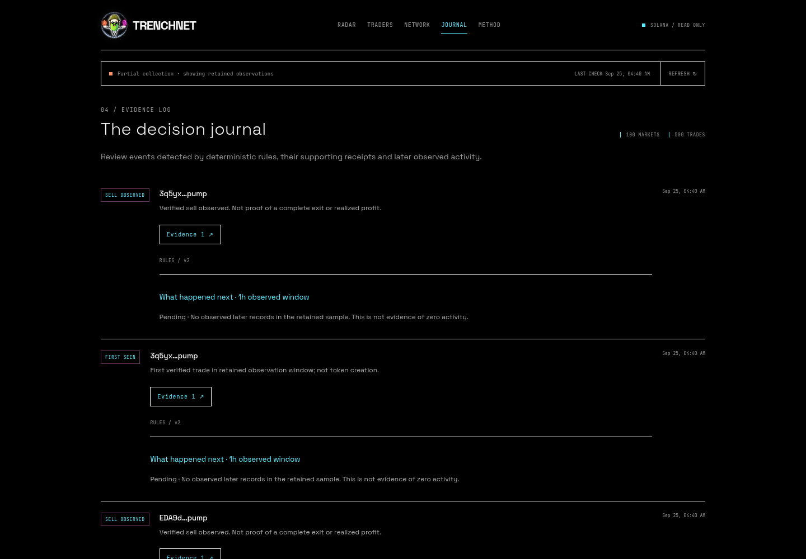

<div align="center">

# TRENCHNET

### Follow the wallets. Inspect the evidence.

**Solana / Pump research · Public observations · Transaction receipts**

<a href="https://trenchnet.app"><strong>Open App ↗</strong></a> &nbsp; · &nbsp; <a href="https://t.me/trenchnetPF_bot"><strong>Telegram ↗</strong></a>

<br>



[Explore the workspace](#four-views-one-research-trail) · [Quick start](#quick-start) · [Setup & data](docs/SETUP.md) · [Visual tour](docs/SHOWCASE.md)

</div>

---

TRENCHNET is a read-only research terminal for exploring a retained sample of Solana/Pump activity. Move from a token to its observed buyers, inspect a wallet's recorded trades, and follow the receipts behind each observation.

No wallet connection. No signatures. No automatic trading.

## Four views. One research trail.

The tour below shows the **hosted app**, captured on September 25, 2026. These are real interface captures, not mockups. The source reported **partial collection**; that status remains visible. [Capture notes and source-version differences →](docs/SHOWCASE.md)

### 01 / Radar

**Start with what was actually observed.**

Browse market information, search a token address, keep a browser watchlist, and switch between markets, signals, buys and sells. Open a transaction receipt instead of taking a label on trust.

[](https://trenchnet.app/#/radar/fresh)

*Fresh is an observed-buy feed, not a list of newly launched tokens. Market listings are not endorsements.*

### 02 / Traders

**Read the activity behind an address.**

Inspect observed buys, sells, tokens and timestamps. Open a wallet to see the transactions behind its sample summary, with SOL amounts where available.

[](https://trenchnet.app/#/traders)

*An activity list, not a profitability leaderboard. SOL totals are not PnL or complete wallet history.*

### 03 / Network

**Token → observed buyers → recorded trades.**

Choose a token, select one of its observed buyers, then inspect that wallet's recorded trades across the current sample. Follow the transaction links or open the address on Solscan.

[](https://trenchnet.app/#/network)

*The current hosted Network is a token-to-wallet investigation view, not a circular graph. Shared token activity does not establish shared ownership or coordination.*

### 04 / Journal

**Keep the observation and its evidence together.**

Review deterministic `FIRST_SEEN`, `CO_BUY` and `SELL_OBSERVED` events, their supporting receipts, and strictly later observations for the same token within a one-hour window.

[](https://trenchnet.app/#/journal)

*First seen means first in the retained sample, not token creation. Missing later records do not mean no activity. The journal is rule-based, not an LLM prediction.*

## Take the watchlist to Telegram

The dedicated [@trenchnetPF_bot](https://t.me/trenchnetPF_bot) is live as a separate worker. Add a wallet, check source status, inspect the recent feed, and explicitly enable or pause alerts.

- **Opt-in:** opening the bot or adding a wallet does not enable alerts.
- **Source-aware:** stale or partial snapshots suppress the feed and alerts.
- **Limited coverage:** following an address filters the existing sample; it does not start full wallet-history collection.

[Commands, consent & delivery semantics →](docs/telegram-bot.md)

## Quick start

For the current hosted interface, [open trenchnet.app](https://trenchnet.app). To run the source in this repository, use **Python 3.11+**:

```sh
git clone https://github.com/immortalhowwl/trenchnet.git
cd trenchnet
python3 server.py
```

Open **http://127.0.0.1:8787**. The application runtime uses only the Python standard library; no pip or npm install is needed to start it. The collector runs in the background. A new database starts empty and fills only after successful upstream requests.

> **Hosted app vs. source:** these screenshots show the newer hosted interface. The checked-in frontend still has the earlier presentation and network graph; this documentation update does not ship those application changes. The local server and collector remain runnable. See [version scope](docs/SHOWCASE.md#hosted-app-and-repository-scope).

[Configuration, API, checks & deployment notes →](docs/SETUP.md)

## What the evidence can — and cannot — tell you

- **Bounded sample, not the whole chain.** Analytics use at most the latest 500 retained trades. Supported Pump bonding-curve events do not cover every Solana route or complete post-migration history.
- **Observed activity, not returns.** No validated PnL, win rate, wallet balances, complete exits, ownership mapping or trader-quality ranking.
- **Market context has selection bias.** Discovery includes DexScreener's paid boost listings; this is not a smart-money signal.
- **Rules, not model inference.** Astra, Jev and other language models are not integrated into the application runtime. The mascot artwork is branding, not an integration claim.
- **Read-only by design.** The application does not accept or move user funds, request private keys, sign transactions or execute trades.

[Data sources, decoding rules & limitations →](docs/SETUP.md#data-and-evidence)

## Project guide

| Resource | What you will find |
| --- | --- |
| [Setup & data](docs/SETUP.md) | Runtime, configuration, API, tests and data boundaries |
| [Visual tour](docs/SHOWCASE.md) | Full-size captures, provenance and hosted/source differences |
| [Telegram guide](docs/telegram-bot.md) | Commands, explicit consent, source gates and persistence |
| [Notification scope](docs/bot-reference-scope.md) | Supported behavior, non-goals and safe self-hosting |
| [Automated checks](https://github.com/immortalhowwl/trenchnet/actions/workflows/tests.yml) | Repository test workflow |

```text
web/              Browser interface
server.py         Read-only HTTP API and application entry point
collector.py      Bounded collection and upstream receipts
analytics.py      Sample summaries, relationships and journal rules
telegram_bot.py   Independent opt-in notification worker
tests/            Python, JavaScript and browser checks
docs/             Setup, evidence boundaries and visual tour
```

---

<div align="center">

**Observe. Connect. Verify.**

[Open TRENCHNET](https://trenchnet.app) &nbsp; · &nbsp; [Open Telegram](https://t.me/trenchnetPF_bot)

</div>
